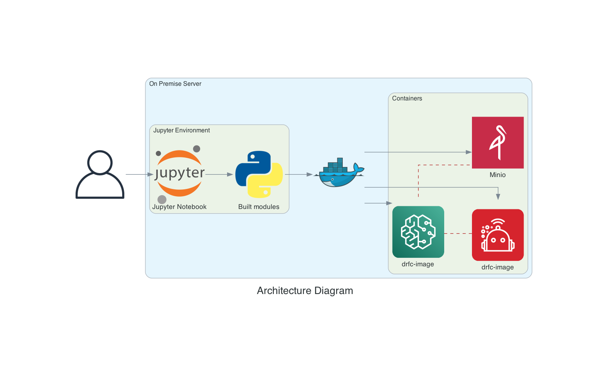

# Notebook DRfC Manager

This solution aims to simplify the model training workflow performed by the DRfC (DeepRacer for Cloud) and empower this process allowing the racer to manage it through a Jupyter Notebook (python environment) allowing the racer to use the advantages of the Machine Learning algorithms.

Currently, the process is very manual and sensitive to user failures and this solution uses Python structures and libraries to ensure the correctness of each required data to perform model training tasks in a better way.

## General Diagram

## Requirements

1. DRfC installed on your machine (currently this solution doesn't include this step)
2. Install the `requirements.txt`
3. Set the right values on `.env` file

Go and start to use it! :rocket:

## Contributing

As you see, the solution is open source to help the bigger amount of racers and find others that also want to help to provide better functionalities. :handshake:

### How to contribute?

Follow this nice tutorial [getting_started_open_source from @gabrieldemarmiesse
](https://github.com/gabrieldemarmiesse/getting_started_open_source)!