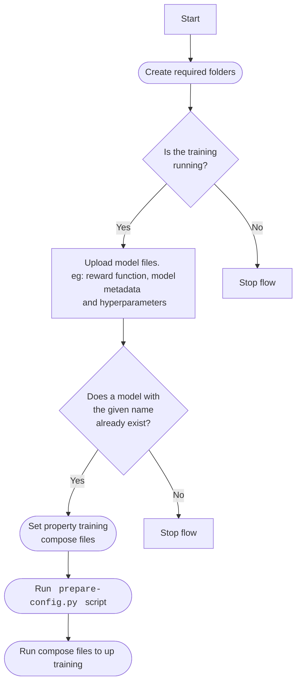

# Start Training workflow

```mermaid
flowchart TD
    A[Start] --> Step1([Create required folders])
    Step1 --> Step2{Is the training \n running?}
    Step2 --> | Yes | Step3[Upload model files. \n eg: reward function, model metadata \n and hyperparameters]
    Step2 --> | No | StepFailedTrainingRunning[Stop flow]
    Step3 --> Step4{Does a model with \n the given name \n already exist?}
    Step4 --> | Yes | Step5([Set property training \n compose files])
    Step4 --> | No | StepFailedModelNameExists[Stop flow]
    class Step6 codeStyle
    Step5 --> Step6([Run <code> prepare-config.py </code> script])
    Step6 --> Step7([Run compose files to up training])
    
```