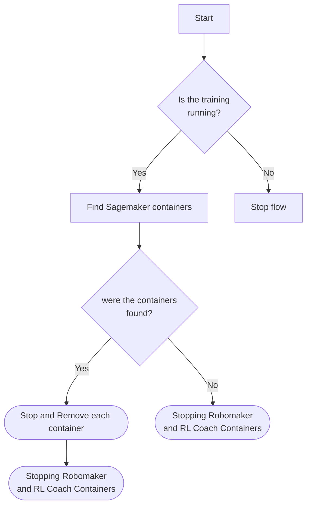

# Stop Training workflow

```mermaid
flowchart TD
    A[Start] --> Step1{Is the training \n running?}
    Step1 --> | Yes | Step2[Find Sagemaker containers]
    Step1 --> | No | StepFailedTrainingRunning[Stop flow]
    Step2 --> Step3{were the containers\n found?}
    Step3 --> | Yes | Step4([Stop and Remove each container])
    Step3 --> | No | Step5([Stopping Robomaker \nand RL Coach Containers])
    Step4 --> Step6([Stopping Robomaker \nand RL Coach Containers])
    
```